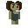
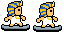
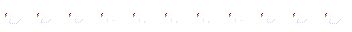

# Bucks Gamedev Club - Demo Game

*Some demo art assets*\

## Getting Started
> [!NOTE]
> This documentation is a work in progress. It may incomplete, incorrect, or both.

We use **GitHub**, **Git LFS**, and **Godot**. Day-to-day work happens on the develop branch; main is the 'stable/always working' branch.

### Repository layout

- `/project.godot`
- `/Assets/`
  -   `/raw/`                 Source art — LFS + locking[^1].
  -  `/exported/`               Game-ready assets Godot references (PNG/WEBP/GLB/OGG, etc)
	  - `/BackgroundTiles/ /Pickups/ /Platforms/ /Sprites/ /TileSets/ /Unused/`
- `/Scenes/`                 .tscn levels/scenes (text, mergeable)
- `/Scripts/`                .gd (and .gd.uid) scripts
- `/docs/`                   guidelines, notes, etc.

>[!WARNING]
>Move/rename assets inside Godot (not in Explorer or Folders) so references update automatically.

### Branching Model
- No direct commits to `main`. Requires PR & Maintainer Approval.
- Work off `develop`. Use short-lived feature branches:
  - `feat/…` – new gameplay/feature (e.g., feat/player-dash)
  - `fix/…` – bug fixes (e.g., fix/hoverboard-collision)
  - `art/…` – asset work (e.g., art/player-idle-v02)
  - `chore/…` – maintenance, refactors (e.g., chore/asset-reorg)
Open PRs (Pull Requests) into `develop`. Maintainers will periodically merge `develop` → `main` (at end of each club meeting, probably) for releases.

### Commit Messages
> [!IMPORTANT]
> Any time you make a commit, change the default commit message! Leaving the default message is not helpful and will quickly lead to the repo getting disorganized!

Be brief and specific.\
Examples:

`feat: add dash cooldown and VFX`\
`art: export player idle v02 (trimmed, 6 frames)`\
`fix: prevent hoverboard from clipping through slopes`

Prefer small, focused commits. Explain why if it’s not immediately obvious.

### One-time set up instructions
Note: The recommended method is to use GitHub desktop. The instructions below **only** apply if you're using git CLI, which is **not recommeded** if you haven't used git before.\
Download GitHub Desktop [by clicking this link](https://desktop.github.com/download/).

`# 1) Clone & LFS`\
`git clone <repo-url>`\
`cd <repo>` \
`git lfs install` <- *that's not gonna work lol I have to update that*\
`# 2) Start on the `develop` branch`\
`git checkout develop`

## Workflow - Developers

## Workflow - Artists

[^1]: Not yet but I'll get it

2. and do some stuff

